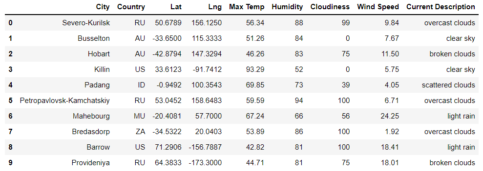
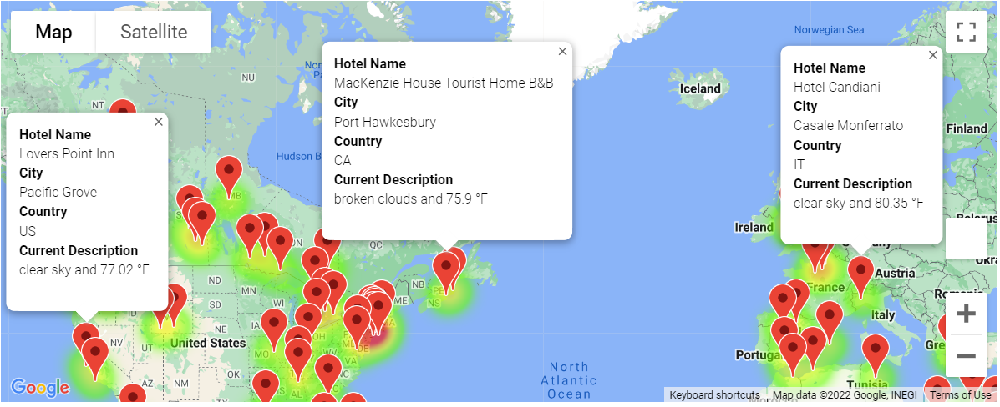
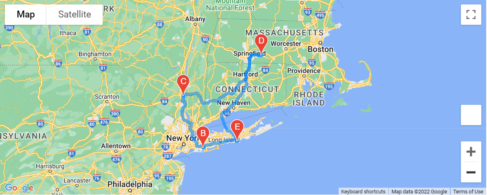
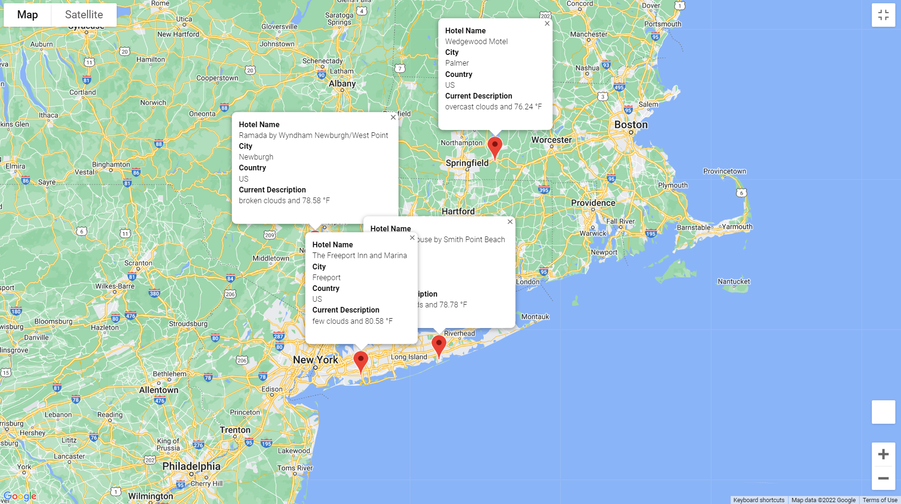

# World_Weather_Analysis

## Purpose

This project is to help users to find their preferred cities based on weather criteria and plan their travel itineraries.

### Results

1. #### City Data

​		We use randomized numbers to generate latitude and longitude pairs.  With the help of citipy module, we get the nearest cities.  Using API calls from OpenWeatherMap, we obtain the weather information about the cities, such as 

- Latitude and longitude
- Maximum temperature
- Percent humidity
- Percent cloudiness
- Wind speed
- Weather description (for example, clouds, fog, light rain, clear sky).

We put all the information into a Pandas DataFrame, shown as the table below and save it to a file named WeatherPy_Database.csv.

2. #### Weather Heatmap and Marker Map

​		The users type in the range of the maximum temperatures for their preferred cities.  In this example, we use 75 to 90 Fahrenheit degrees.  Then we use google geocode API to find the nearest hotels and display them on a google map (using the gmaps function) with the heatmap of maximum temperatures and the hotel information, as shown in the following figure.

3. #### Travel Itinerary

​		From the list of potential travel destinations, the users choose 4 cities.  We use Google Maps Directions API to display the travel itinerary on a google map, as shown in the following figure.

​		At the end, we display the information of the 4 cities on a marker google map, as shown below.

